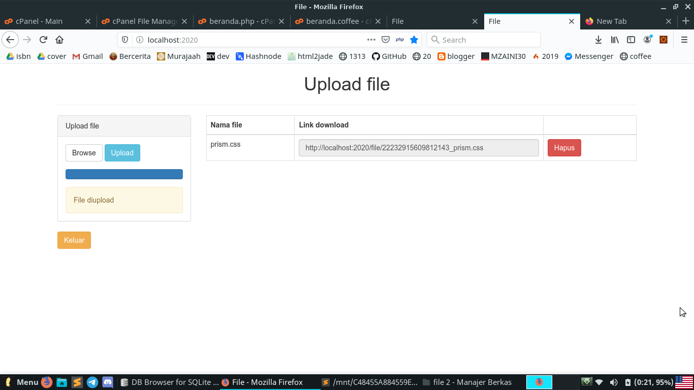

# Contoh website untuk upload file-file besar



## Getting started

```bash
composer update
npm i 
```

## Menjalankan website

```bash
bash dev.sh
```

Nanti linknya: `localhost:2020`.

## Username dan password

```
Username: admin
Password: admin
```

## Variabel yang harus disetting kalau mau diupload ke server

- pug/beranda.coffee (variabel situs)

## Kekurangan

- File PHP masih bisa dieksekusi (shell script)
